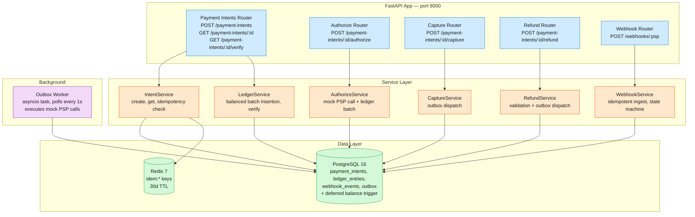

# Payment System MVP — Design & Specification

Backend implementation of a payment-intent processing spine: create payment intents with idempotency,
authorize and capture funds through a two-phase lifecycle, refund (partial or full), reconcile every
movement against a double-entry ledger, and idempotently ingest PSP webhook events. One FastAPI process
serves the REST API, PostgreSQL 16 holds the ledger and the transactional outbox, Redis 7 backs the
idempotency cache. The full target design forwards idempotency keys to real PSPs (Stripe/Adyen), runs
Redis clusters with cross-region replication, and propagates ledger events via CDC/Kafka; this MVP
implements the same payment spine with a mock PSP adapter and a polling outbox, using the same
double-entry ledger invariant that production depends on.

## 1. Architecture



**Layers:** Router (HTTP parse/validate/serialize, no business logic) -> Service (domain logic + data
access) -> Model (SQLAlchemy 2.0 async ORM, PostgreSQL). Routers map service exceptions to HTTP codes
(`LookupError` -> 404, `ValueError` -> 409/422, `IdempotencyConflictError` -> 409).

**Mock PSP adapter** (`services/psp_adapter.py`) returns deterministic responses — no external network
calls. The reference is always `psp_{intent_id[:8]}`, so acceptance tests are repeatable.

**Outbox worker** (`workers/outbox_worker.py`) is a background `asyncio` task started in the FastAPI
lifespan — no separate worker container at MVP scale. It claims pending rows one at a time with
`SELECT ... FOR UPDATE SKIP LOCKED`, executes the mock PSP call, advances the intent status, writes the
settlement/reversal ledger batch, and stamps `processed_at`. Failures increment `retry_count`; rows are
dead-lettered (stamped processed with `error` set) after 10 attempts.

**Intent state machine:**

```
created ──authorize──▶ authorized ──capture──▶ capturing ──outbox worker──▶ captured
                                                                               │
                                                              refund ──▶ refunding ──outbox worker──▶ refunded
```

Invalid transitions (capture on `created`, refund on `authorized`, re-authorize on `authorized`, ...)
return `409`. A webhook (`payment_intent.succeeded` / `charge.refunded`) with a matching
`psp_reference` can also advance `capturing -> captured` / `refunding -> refunded`.

## 2. Key Design Decisions

### D1: Idempotency — Redis SET + DB unique constraint (two-layer guard)

**Decision:** Primary guard is the Redis cache at `idem:{key}` (30-day TTL) storing the full serialized
response plus the original request parameters. Secondary guard is `UNIQUE(idempotency_key)` on
`payment_intents`, with a DB lookup fallback when Redis misses.

**Rationale:** The Redis cache replays the *response*, not just the intent record — a retry never
re-executes the create path at all. The DB unique constraint plus the fallback lookup catches the edge
case where Redis is unavailable or evicted. Replays with the same key and same body return `200` with
the cached response; the same key with a *different* body is rejected with `409` (the cached
`_params` are compared field by field).

**Trade-off:** Redis introduces a second data store for what could be a DB-only solution, but it teaches
the pattern production requires: in a real deployment the PSP's own idempotency layer (forwarding the
key) is the third and final guard.

### D2: Outbox pattern — polling, not LISTEN/NOTIFY or synchronous PSP calls

**Decision:** Capture and refund do not call the PSP in the request handler. They write a durable
`outbox` row (`capture_requested` / `refund_requested`) in the same transaction that transitions the
intent to `capturing` / `refunding`, and return immediately. A background worker polls the outbox every
1 second and executes the PSP call.

**Rationale:** Durability. If the PSP call succeeded and the server crashed before writing the ledger,
money moved with no record. The outbox decouples "accept the request" from "execute the PSP call" — the
request is durably stored in Postgres before the PSP is ever called. The 1-second poll adds at most ~1s
of latency to capture/refund completion.

**Trade-off:** Synchronous PSP calls would be simpler — one fewer moving part — but lose the crash
consistency guarantee that a payments system exists to provide.

### D3: Single-process outbox worker, not a separate container

**Decision:** The worker is an `asyncio` task started during app lifespan, stopped on shutdown.

**Rationale:** At MVP scale there is no operational benefit to a separate worker container — it would
need its own connection pool, healthcheck, and compose service for negligible CPU. Row claiming uses
`FOR UPDATE SKIP LOCKED`, so the design scales out to multiple workers without code changes when
throughput demands it.

### D4: Deterministic mock PSP

**Decision:** The mock PSP always succeeds and returns `psp_{intent_id[:8]}`.

**Rationale:** The MVP's purpose is to exercise the *system's* logic — the state machine, the ledger,
the outbox — not PSP integration. A deterministic mock keeps the acceptance suite fast and repeatable.
Retry/dead-letter handling exists in the worker (`retry_count`, `error`, max 10 attempts) but is not
exercised by a flaky mock.

### D5: Ledger integrity — application-level pairing + deferred constraint trigger

**Decision:** `LedgerService.insert_batch` always inserts a debit+credit pair sharing one `batch_id`
inside the caller's transaction. A PostgreSQL `CONSTRAINT TRIGGER ... DEFERRABLE INITIALLY DEFERRED`
(created in migration `001`) re-checks at commit time that each batch's debits equal its credits and
raises on any unbalanced batch.

**Rationale:** Code discipline alone is fragile — a single buggy code path poisons the books
permanently. The trigger catches any writer (future refactors, operator SQL) that inserts an unbalanced
entry. The per-commit overhead is a grouped SUM over the new rows — negligible.

### D6: Denormalized running balance

**Decision:** Every ledger entry carries `balance_after`. The current balance is read with
`ORDER BY created_at DESC LIMIT 1` instead of summing all rows.

**Trade-off:** One extra integer write per entry saves a full scan on every status poll.

### D7: Webhook idempotency via PSP event id as primary key

**Decision:** `webhook_events.id` is the PSP's event id. A duplicate event returns
`200 {received: true, duplicate: true}` without reprocessing — no separate dedup table.

## 3. Data Model

```sql
payment_intents {
  id:              uuid PK
  idempotency_key: text UNIQUE NOT NULL     -- client-supplied; DB-level idempotency guard
  amount:          integer NOT NULL          -- minor units (cents); never float
  currency:        varchar(3) DEFAULT 'usd'  -- ISO 4217
  status:          varchar(20) DEFAULT 'created'
                   -- created | authorized | capturing | captured | refunding | refunded
  psp_reference:   text NULL                 -- set on authorization
  payment_method:  varchar(50) NOT NULL      -- tokenized method; never raw PAN
  created_at:      timestamptz DEFAULT now()
}

ledger_entries {
  id:             uuid PK
  intent_id:      uuid FK -> payment_intents (ON DELETE CASCADE)
  batch_id:       uuid NOT NULL              -- groups a balanced debit+credit pair
  side:           varchar(6)                 -- debit | credit
  amount:         integer NOT NULL           -- always positive; side determines sign
  balance_after:  integer NOT NULL           -- denormalized running balance
  description:    text NOT NULL              -- 'authorization hold' | 'capture settlement' | 'refund reversal'
  created_at:     timestamptz DEFAULT now()
}
-- + deferred constraint trigger: per batch_id, SUM(debit) must equal SUM(credit) at commit

webhook_events {
  id:             text PK                    -- the PSP's event id (idempotent ingest)
  psp:            varchar(20)                -- stripe | adyen
  type:           varchar(50)                -- e.g. payment_intent.succeeded, charge.refunded
  payload:        jsonb
  processed_at:   timestamptz NULL
  created_at:     timestamptz DEFAULT now()
}

outbox {
  id:             uuid PK
  event_type:     varchar(30)                -- capture_requested | refund_requested
  payload:        jsonb                      -- {intent_id, amount, psp_reference}
  processed_at:   timestamptz NULL           -- claimed via FOR UPDATE SKIP LOCKED where NULL
  error:          text NULL
  retry_count:    integer DEFAULT 0          -- dead-lettered at 10
  created_at:     timestamptz DEFAULT now()
}
```

**Redis key schema:** `idem:{idempotency_key}` -> `{response, _params}` JSON, TTL 30 days
(`IDEMPOTENCY_TTL_SECONDS=2592000`). `_params` holds the original `{amount, currency, payment_method}`
for reuse-with-different-body detection.

All tables are created by the single Alembic migration `alembic/versions/001_initial.py`, including the
`check_ledger_batch_balance()` trigger function.

## 4. API Reference

### Health

`GET /healthz` — Liveness probe. `200 {"status": "ok"}`. Used by the compose healthcheck and CI READY probe.

### Payment intents

`POST /payment-intents` — Create a payment intent. Requires an `Idempotency-Key` header.

```
Headers:  Idempotency-Key: <string>          (missing -> 422)
Request:  {amount: int > 0, currency: "usd", payment_method: str}
201:      {id, idempotency_key, amount, currency, status: "created", payment_method, created_at}
200:      Same key + same body replayed -> cached response
409:      Same key + different body
422:      amount <= 0, invalid currency length, missing fields
```

`GET /payment-intents/{id}` — Status plus full ledger history.

```
200:  {id, idempotency_key, amount, currency, status, payment_method, psp_reference,
       created_at, ledger_entries: [{side, amount, description, balance_after, created_at}, ...]}
      ledger_entries ordered by created_at ASC
404:  Unknown intent
```

`GET /payment-intents/{id}/verify` — Zero-sum ledger check for one intent.

```
200:  {intent_id, debits_total, credits_total, balanced: true|false}
404:  Unknown intent
```

### Lifecycle

`POST /payment-intents/{id}/authorize` — Synchronous mock-PSP authorization.

```
200:  {id, status: "authorized", psp_reference, amount, currency, authorized_at}
      Side effect: balanced ledger batch "authorization hold"
404:  Unknown intent    409: status is not "created"
```

`POST /payment-intents/{id}/capture` — Asynchronous capture via outbox.

```
200:  {id, status: "capturing", amount, currency, psp_reference}   (immediate)
      The outbox worker advances the intent to "captured" and writes the
      "capture settlement" ledger batch within ~1s.
404:  Unknown intent    409: status is not "authorized"
```

`POST /payment-intents/{id}/refund` — Asynchronous partial/full refund via outbox.

```
Request:  {amount?: int > 0}     -- omitted = full refund
200:      {id, status: "refunding", refund_amount}   (immediate)
          The outbox worker advances the intent to "refunded" and writes the
          "refund reversal" ledger batch within ~1s.
404:  Unknown intent    409: status is not "captured"    422: amount exceeds captured amount
```

### Webhooks

`POST /webhooks/{psp}` — Idempotent PSP event ingestion (`psp` in {stripe, adyen}).

```
Request:  {id: str, type: str, data: {psp_reference?, ...}}
200:      {received: true}                       (first delivery)
200:      {received: true, duplicate: true}      (same event id again — no reprocessing)
400:      Unknown psp path param
422:      Missing id/type
```

Side effect: if `data.psp_reference` matches an intent, `payment_intent.succeeded` advances
`capturing -> captured` and `charge.refunded` advances `refunding -> refunded`.

## 5. Functional Requirements -> Acceptance Tests

Each FR maps to one black-box acceptance file in `verify/acceptance/` (33 tests total). All tests talk
to the running stack over HTTP at `API_BASE_URL` — no app imports; isolation comes from unique
idempotency keys per test.

| FR | Requirement | Test file | What it proves |
|----|------------|-----------|----------------|
| — | Health | `test_healthz.py` | `GET /healthz` -> 200 `{"status":"ok"}` |
| FR1 | Create payment intent with idempotency | `test_fr1_create_payment_intent.py` | 201 with all fields; missing `Idempotency-Key` -> 422; zero/negative amount -> 422; duplicate key -> cached response; key reuse with different body -> 409; unknown id -> 404 |
| FR2 | Authorize + capture lifecycle | `test_fr2_authorize_capture.py` | Authorize -> `authorized` + `psp_reference`; capture -> `capturing`, polls until worker lands `captured`; invalid transitions -> 409; unknown intent -> 404 |
| FR3 | View status + ledger history | `test_fr3_view_payment_intent.py` | Full detail response; debit+credit pair after authorize; "authorization hold" and "capture settlement" entries after capture; `balance_after` on every entry; 404 for unknown id |
| FR4 | Partial/full refund | `test_fr4_refund.py` | Full refund -> `refunded` (polled); partial refund honors explicit amount; refund on non-captured -> 409; over-refund -> 422 |
| FR5 | Zero-sum ledger verification | `test_fr5_ledger_verify.py` | `balanced=true` after authorize; still balanced after authorize+capture+refund; debits total == credits total; unknown intent -> 404 |
| FR6 | Webhook ingestion | `test_fr6_webhooks.py` | 200 + received; duplicate event id -> `duplicate: true`; missing id / empty body -> 422; unknown psp -> 400; matching `psp_reference` advances intent state |

## 6. Test Scenarios

The acceptance suite doubles as the scenario matrix — every scenario is exercised end-to-end over HTTP
against the composed stack (`app` + `db` + `redis`):

| Scenario | Where exercised |
|----------|-----------------|
| Idempotent create: same key twice -> one intent, replayed response | `test_fr1_...::test_idempotency_duplicate_key_returns_cached` |
| Idempotency conflict: same key, different body -> 409 | `test_fr1_...::test_idempotency_reuse_key_different_body` |
| Input validation: zero/negative amount, missing header -> 422 | `test_fr1_...` validation tests |
| Full lifecycle: created -> authorized -> capturing -> captured (async via outbox worker) | `test_fr2_...::test_capture_intent` (polls to `captured`) |
| State machine enforcement: every invalid transition -> 409 | `test_fr2_...`, `test_fr4_...` |
| Ledger writes: every state change lands a balanced debit+credit batch with running `balance_after` | `test_fr3_...` |
| Async refund: captured -> refunding -> refunded with reversal batch | `test_fr4_...` (polls via `wait_for_status`) |
| Zero-sum invariant holds across the whole lifecycle | `test_fr5_...` |
| Webhook dedup + state advancement by `psp_reference` | `test_fr6_...` |

White-box test scaffolding lives in `tests/` (pytest + anyio fixture); the black-box acceptance suite in
`verify/acceptance/` is the functional gate, wired into CI and into the `verify/manifest.env` e2e
contract (UP/READY/ACCEPTANCE/DOWN lifecycle for the host verify loop).

## 7. Test Results

Continuous integration runs three workflows on every push and daily on schedule:

| Workflow | What it runs | Badge |
|----------|--------------|-------|
| lint | ruff check + ruff format (0.8.x) | [](https://github.com/iliazlobin/sd-payment-system-backend-mvp/actions/workflows/lint.yml) |
| ci | Docker image build + container start check | [](https://github.com/iliazlobin/sd-payment-system-backend-mvp/actions/workflows/ci.yml) |
| functional | Full compose stack (Postgres + Redis + app), Alembic migrations, then the 33-test black-box acceptance suite | [](https://github.com/iliazlobin/sd-payment-system-backend-mvp/actions/workflows/functional.yml) |

Live runs: [lint](https://github.com/iliazlobin/sd-payment-system-backend-mvp/actions/workflows/lint.yml)
· [ci](https://github.com/iliazlobin/sd-payment-system-backend-mvp/actions/workflows/ci.yml)
· [functional](https://github.com/iliazlobin/sd-payment-system-backend-mvp/actions/workflows/functional.yml)

## 8. Stack

| Component | Technology |
|-----------|-----------|
| Runtime | Python 3.12, FastAPI, uvicorn |
| Datastore | PostgreSQL 16 via SQLAlchemy 2.0 (async) + Alembic |
| Cache | Redis 7 (idempotency, `redis.asyncio`) |
| Background work | Transactional outbox table + in-process asyncio polling worker |
| Tests | pytest + httpx (black-box HTTP acceptance) |
| Linting | ruff 0.8.x |
| Container | Docker Compose (`app` + `db` + `redis`), multi-stage Dockerfile on `python:3.12-slim` |
| CI | GitHub Actions (lint, ci, functional — on every push + daily schedule) |
